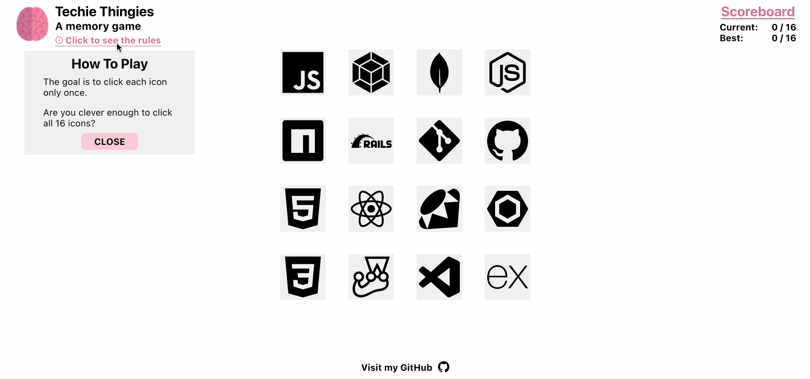

# memory game

this is the [second react project](https://www.theodinproject.com/paths/full-stack-javascript/courses/javascript/lessons/memory-card) from the odin project's full stack javascript curriculum.

## live version

[click here](https://jernestmyers.github.io/memory-game/) for a live version!

## how to play

1. each click on an image will rearrange the images displayed.
2. the game ends if you click on the same image twice or achieve a perfect score.
3. click on each of the 16 images only once to earn a perfect score of 16.

## project objectives

1. build the app with react and use functional components with hooks to manage state.
2. include a scoreboard to track current and best scores.

## technologies used

 
 
 

## app features

1. users can toggle a button to display/hide an explanation of the game.
2. a scoreboard displays in real-time the current score and the best score.
3. a message is displayed when the game ends- whether by achieving a perfect score of 16 or by mistakingly duplicating an image.

## areas for improvement

1. ~thus far has only been formatted to display effectively on my 13" macbook air.~
2. the modals' style could be improved.
3. i would prefer that the icons are not randomized upon the game's end. would require some tweaks to state management to achieve this.
